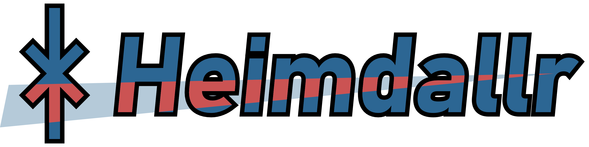

.. Heimdallr documentation master file, created by
   sphinx-quickstart on Sat Jun  8 11:12:33 2024.
   You can adapt this file completely to your liking, but it should at least
   contain the root `toctree` directive.

Heimdallr is a package for simplifying instrument control. It is designed to build
off of libraries like `pyvisa`_ and `pyvisa-py`_ and provide a complete ecosystem for 
instrument automation. As a brief example of what this can look like in its simplest form, 
here's an example script which connects to an instrument, resets it, then adjusts and reads 
some basic settings:

.. code-block:: python
	:linenos:
	
	from heimdallr.all import *
	
	# Create log object
	log = LogPile()
	
	# Create NRX Driver
	nrx = RohdeSchwarzNRX("TCPIP0::192.168.0.10::INSTR", log)
	
	# Preset device
	nrx.preset()
	
	# Get meas frequency
	nrx.set_meas_frequency(1e9)
	fmeas = nrx.get_meas_frequency()

Links
=====

This is how you can link to the `GitHub`_ or `PyPI`_.

You can add bullets like this: 

* Bullet 1
* Bullet 2 

This is going to be the table of contents.

.. toctree::
   :maxdepth: 2
   :caption: Contents:
   
   overview.md
   installation
   modules
   pages/what_why_heimdallr.md

Indices and tables
==================

* :ref:`genindex`
* :ref:`modindex`
* :ref:`search`

.. _pyvisa-py: https://github.com/pyvisa/pyvisa-py
.. _pyvisa: https://github.com/pyvisa/pyvisa
.. _GitHub: https://github.com/Grant-Giesbrecht/Heimdallr
.. _PyPI: https://pypi.org/project/heimdallr-py/
.. _what_and_why: https://pypi.org/project/heimdallr-py/